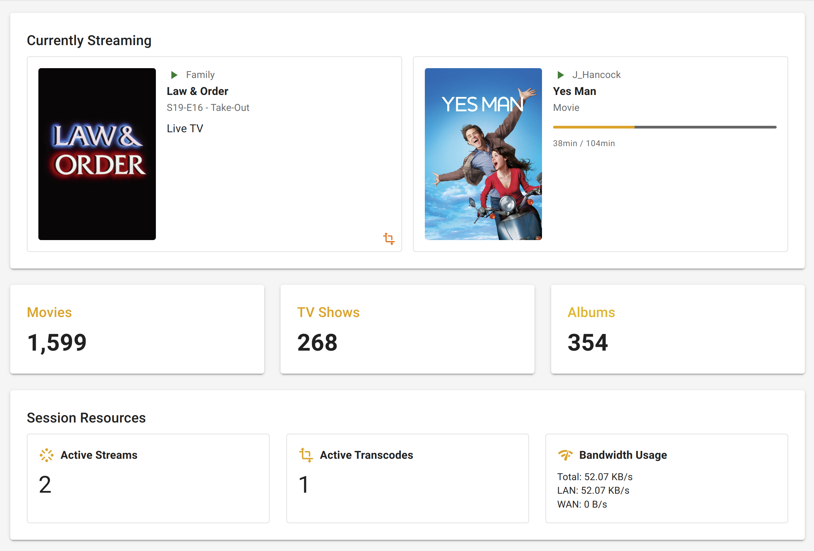

# MediaStats

## Simple Plex Media Stats




## Support this project

[](https://www.buymeacoffee.com/jereme)

### Docker Run

```bash
docker pull bozodev/mediastats:latest
```


```bash
docker run -d --name=mediastats -p 3778:3778 --restart unless-stopped bozodev/mediastats:latest
```


### Docker Compose

Create docker-compose.yml:

```bash
services:
  nextjs:
    image: bozodev/mediastats:latest
    ports:
      - "3778:3778"

    container_name: mediastats
    restart: unless-stopped
```

```bash
docker-compose pull
```

```bash
docker-compose up -d
```


It is recommended to run this on the same server where your Plex Media Server is installed. That way you can use `http://SERVER-NAME-OR-IP:3778` to access MediaStats on your local network.

If you want to run this on another machine you could use somethink like [Tailscale](https://tailscale.com/) to ensure both your server running Plex Media Server and the machine running MediaStats can communicate on your local network.


## License

[MIT License](LICENSE)

## AI Assistance Disclosure

This tool was developed with assistance from AI language models.