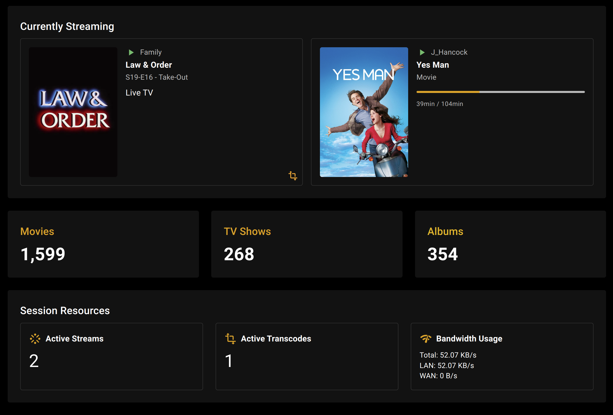

# MediaStats

## Simple Plex Media Stats



### Docker Run

`docker pull bozodev/mediastats:latest`

`docker run -d --name=mediastats -p 3778:3778 --restart unless-stopped bozodev/mediastats:latest`

### Docker Compose

Create docker-compose.yml:

```
services:
  nextjs:
    image: bozodev/mediastats:latest
    ports:
      - "3778:3778"

    container_name: mediastats
    restart: unless-stopped
```

`docker-compose pull`

`docker-compose up -d`
